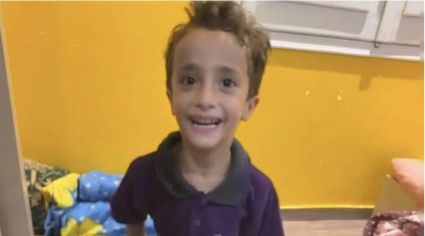

# 🌟 عَالَمُ آدَم السَّاحِر | Adam's Magical World 👑

### الموقع الرسمي التفاعلي للبطل الصغير آدم ✨

 

 
 

---

## 📖 حول المشروع

**عالم آدم الساحر** هو تطبيق ويب تفاعلي ومبهج تم بناؤه خصيصاً لإسعاد البطل الصغير **آدم**، وتشجيعه على ممارسة العادات اليومية الإيجابية، بالإضافة إلى توفير بيئة مرحة للرسم التفاعلي وألعاب تقوية الذاكرة بالأصوات والاحتفالات.

---

## ✨ المميزات الرئيسية

* **👑 بطاقة البطل الملكية:** إطار ذهبي بتاج ملكي متحرك لعرض صورة آدم الحقيقية مع أدوات تكبير وتدوير مخصصة.
* **🔊 تحية صوتية واحتفالات:** رسالة ترحيبية صوتية تنطق اسم آدم باللغة العربية مع مؤثرات كونفيتي متطايرة.
* **⭐ لوحة نجوم السلوكيات:** نظام تحفيزي لتسجيل إنجازات اليوم (تنظيف الأسنان، ترتيب الألعاب، تناول الأكل الصحي) بمؤثرات صوتية تشجيعية.
* **🎨 مرسم آدم السحري:** لوحة رسم تفاعلية تدعم شاشات اللمس والماوس مع ألوان متعددة، ملصقات كرتونية، وإمكانية حفظ اللوحة كصورة.
* **🧩 لعبة أبطال الذاكرة:** لعبة بطاقات ذكية خفيفة لاختبار وتقوية الذاكرة بالأصوات التفاعلية.

---

## 🛠️ التقنيات المستخدمة

* **HTML5 & Vanilla JavaScript**
* **Tailwind CSS** للتصميم والتنسيق المتجاوب
* **Web Audio API** لإنتاج المؤثرات الصوتية الفورية دون ملفات خارجية
* **Web Speech API** للقراءة الصوتية التفاعلية
* **Canvas API** للمرسم التفاعلي
* **Canvas Confetti** لمؤثرات الاحتفال

---

## 🚀 كيفية التشغيل

1. وجود ملف الواجهة الرئيسي باسم `index.html`.
2. وجود صورة البطل في نفس المسار باسم `adam.jpg`.
3. فتح الموقع مباشرة عبر متصفح الويب أو من خلال منصة الاستضافة:

🔗 **رابط الموقع المباشر:** [adam-magic-world.vercel.app](https://adam-magic-world.vercel.app)

---

صُنع بكل حب للبطل **آدم** 💖

